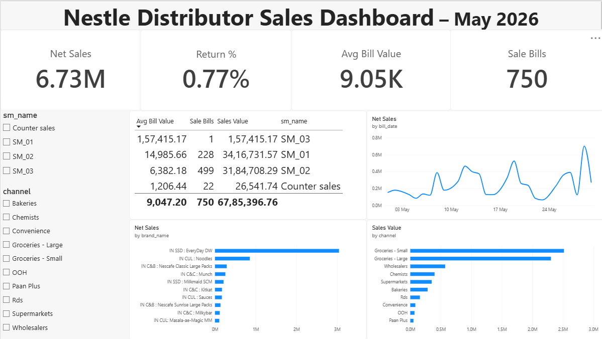
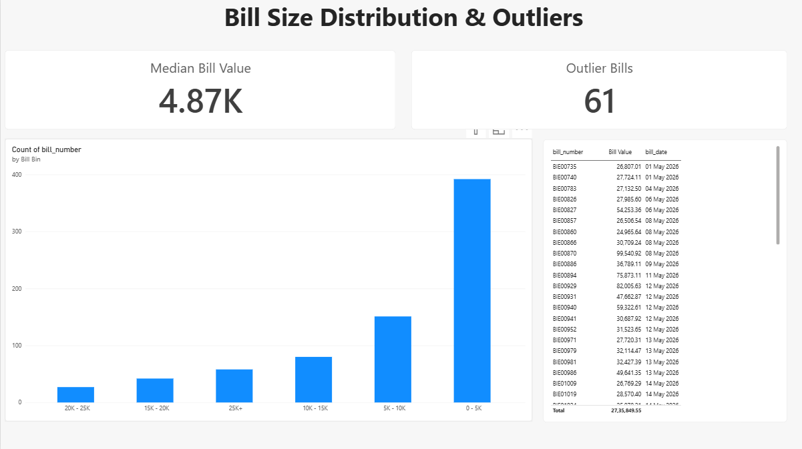

# SQL Sales Analysis: FMCG Distributor, May 2026

PostgreSQL, SQL, Power BI, Excel
 All retailer and salesman names are anonymized (`R001`–`R261`, `SM_01`–`SM_03`). No personal or business-identifying information is included.

---

## Tools Used

| Stage | Tool |
|---|---|
| Data cleaning | Microsoft Excel |
| Database | PostgreSQL (pgAdmin 4) |
| Analysis | SQL (joins, CTEs, window functions, aggregates, percentiles) |
| Dashboard | Power BI Desktop (DAX measures, calculated columns) |

---

## Project Workflow

1. **Clean:** removed the grand-total row and empty/constant columns, renamed 38 headers to `snake_case`, filled blanks, flagged each row as `Sale` or `Return` from the bill-number prefix, and anonymized names.
2. **Model:** designed a 6-table relational schema with primary and foreign keys.
3. **Load:** loaded the CSV into a staging table, then populated each table with `INSERT ... SELECT DISTINCT` in parent-first order.
4. **Verify:** checked row counts and confirmed the net amount total matches the original file exactly (₹67,33,318.47).
5. **Analyse:** wrote 13 SQL queries (business questions and statistics).
6. **Visualise:** built a 2-page Power BI dashboard on top of the database.

---

## Database Design


`salesmen → routes → retailers → bills → sale_lines ← products`

| Table | Rows |
|---|---|
| salesmen | 4 |
| routes | 11 |
| retailers | 261 |
| products | 190 |
| bills | 803 |
| sale_lines | 6,354 |

Files: [`schema.sql`](schema.sql) (tables and keys) and [`load_data.sql`](load_data.sql) (ETL from staging plus verification queries).

---

## SQL Analysis

All queries are in [`queries.sql`](queries.sql).

**Business questions**
- Sales by brand and by sales channel
- Return percentage
- Most frequent retailers
- Salesman performance
- Bill-size buckets using `CASE WHEN`
- Top 3 products per brand using `RANK()` window function
- Daily cumulative sales trend using `SUM() OVER`

**Statistical analysis**
- Mean vs median bill value (CTE)
- Percentile distribution using `PERCENTILE_CONT`
- Outlier detection with the IQR method
- Standard deviation and coefficient of variation per salesman
- Correlation between discount % and bill size using `CORR`

---

## Power BI Dashboard

Built in Power BI Desktop, connected live to the PostgreSQL database. File: [`sales_dashboard.pbix`](sales_dashboard.pbix)

### Page 1: Overview


KPI cards (Net Sales, Sale Bills, Avg Bill Value, Return %), top 10 brands, sales by channel, daily sales trend, salesman performance table, and channel and salesman slicers.

### Page 2: Statistics


Bill size distribution (histogram), median bill value, outlier count, and a table of outlier bills.

---

## Key Findings

- **Net sales:** ₹67.3 lakh in May 2026, with returns at only **0.77%** of sales value.
- **Brand concentration:** one brand (EveryDay DW) accounts for about **45%** of sales.
- **Channel concentration:** about **71%** of sales come from just 2 channels.
- **Skewed bill sizes:** the median bill is **₹4,871** but the mean is **₹9,284**, so a few very large bills pull the average up.
- **Outliers:** 61 bills above ₹24,298 (IQR fence) are about **8.4%** of bills but **40.5%** of total sales.
- **Salesman consistency:** bill-size variability differs a lot between salesmen (coefficient of variation 92% for SM_01 vs 178% for SM_02).
- **Discounts:** discount % has only a weak correlation with bill size (r = 0.29).

---

## Business Takeaways

- Protect and grow the top brand, but reduce dependence on it by pushing the next brands.
- A small group of large-bill retailers drives a big share of revenue, so they deserve priority service and stock availability.
- The median, not the mean, is the realistic "typical bill" for planning targets.

---

## Repository Structure

```
├── README.md
├── schema.sql
├── load_data.sql
├── queries.sql
├── erd.png
├── sales_dashboard.pbix
├── dashboard_overview.png
├── dashboard_statistics.png
└── data/
    └── sales_clean.csv
```

## How to Run

1. Create a PostgreSQL database and run `schema.sql`.
2. Import `data/sales_clean.csv` into the `stg_sales` table.
3. Run `load_data.sql` to fill the tables and check the verification queries.
4. Run the queries in `queries.sql`.
5. Open `sales_dashboard.pbix` in Power BI Desktop and point it to your database.

---

## Author

**Joshna Budha**: Final-year B.Tech (CSE, AI/ML), aspiring Data Analyst
GitHub: [joshnab66](https://github.com/joshnab66)

