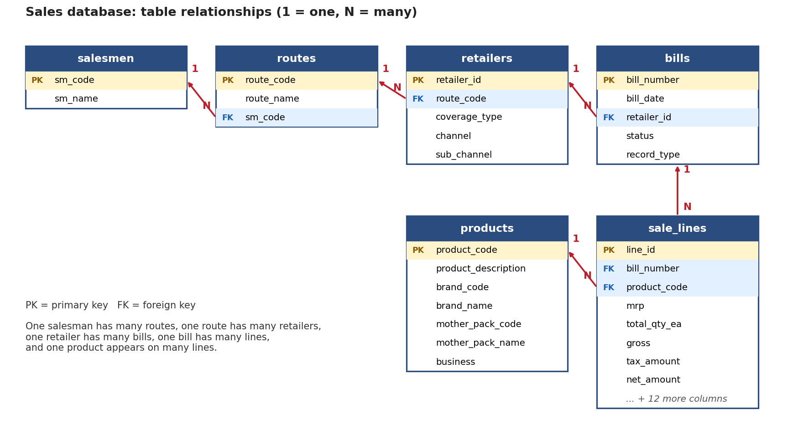

# SQL Sales Analysis: FMCG Distributor, May 2026

An end-to-end SQL project: I took a raw monthly sales report from an FMCG distributor, cleaned it, designed a normalized PostgreSQL database, and wrote queries to answer real business questions about brands, retailers, channels, salesmen and returns.

**Tools:** Microsoft Excel (cleaning) · PostgreSQL · pgAdmin 4

---

## The data

- Source: the distributor's master sales report for **1 to 30 May 2026**
- **6,354 bill lines** · 803 bills · 261 retailers · 190 products · 26 selling days
- Retailer and salesman names are **masked** (`R001`, `SM_01`, ...) to protect business data

## Cleaning (Excel)

1. Removed the report's grand-total row, which would have doubled every sum
2. Deleted columns that were empty or held a single value (for example, key account, cess)
3. Renamed 37 columns to clean `snake_case` names
4. Added `record_type`. Bills starting `URN` or `SRN` are **Returns**; `BIE` and `CIR` (counter sales) are **Sales**
5. Filled blank values with `Unknown`
6. Anonymized retailers and salesmen
7. Checked that the net total (₹67,33,318.47) is the same before and after cleaning

## Database design

The flat file repeated the same retailer, product and bill details on thousands of rows. I split it into 6 tables:

```
salesmen ──< routes ──< retailers ──< bills ──< sale_lines >── products
```

| Table | Primary key | Holds |
|---|---|---|
| `salesmen` | `sm_code` | salesman name |
| `routes` | `route_code` | route name, salesman (FK) |
| `retailers` | `retailer_id` | route (FK), coverage type, channel, sub-channel |
| `products` | `product_code` | description, brand, mother pack, business |
| `bills` | `bill_number` | date, retailer (FK), status, Sale or Return |
| `sale_lines` | `line_id` | bill (FK), product (FK), quantities, discounts, tax, net amount |

`sale_lines` has its own `line_id` because the same product can appear twice on one bill. MRP is kept on the line, because it changed for 20 products during the month.



Row counts after loading (4 / 11 / 261 / 190 / 803 / 6,354) and the total net amount match the source file exactly.

## Queries ([queries.sql](queries.sql))

| # | Question | SQL used |
|---|---|---|
| 1 | Which brands bring the most net sales? | JOIN, GROUP BY |
| 2 | How much sales value is lost to returns? | CTE, CASE WHEN |
| 3 | Which retailers buy most often (more than 5 bills)? | 3-table JOIN, HAVING |
| 4 | How does each salesman perform? | 5-table JOIN |
| 5 | How many bills are small, medium or large? | CTE, CASE WHEN |
| 6 | Which channels bring the most sales? | JOIN, GROUP BY |
| 7 | Average vs median bill value per salesman | CTE, PERCENTILE_CONT |
| 8 | Top 3 products inside each brand | CTE, RANK() OVER (PARTITION BY) |
| 9 | Cumulative daily sales across the month | CTE, SUM() OVER |

## Key findings

- **One brand drives almost half the business.** `EveryDay DW` brings **45%** of net sales, and the top 3 brands bring **62%**.
- **Returns are small.** Returned goods are only **0.77%** of sales value (₹52,078 of ₹67.9 lakh).
- **A few large bills carry the month.** 207 bills over ₹10,000 (28% of bills) bring **73%** of sales. Only 215 small bills (under ₹2,000) add up to just ₹1.7 lakh.
- **Two channels dominate.** Small and large grocery stores bring **71%** of sales (37% and 34%).
- **The average bill is misleading.** The average bill is about ₹9,300, but the median is only about ₹4,900, because a few big bills pull the average up.
- **Salesmen differ in bill size.** `SM_01` has a median bill of ₹10,460, more than 3 times `SM_02`'s ₹3,046, although `SM_02` covers more retailers (190 vs 66).
- **Sales are spread across many retailers.** The top 10 retailers bring only about 24% of sales, and 59 of 257 buying retailers bought just once in the month.
- **Rhythm of the month.** There were no sales on Sundays. Sales peaked on 29 May (₹7.0 lakh) and were lowest on 23 May (₹0.65 lakh). Tuesday and Friday were the strongest weekdays.

## Recommendations

1. **Reduce dependence on one brand.** With 45% of sales in a single brand, a stock-out or price change would hit hard. Push the next brands (Noodles, Nescafe Classic, Munch) with retailers who currently buy only `EveryDay DW`.
2. **Grow `SM_02`'s bill size.** Their median bill is about a third of `SM_01`'s. A target of "more products per bill" or bundle schemes for their small grocery retailers could lift sales without adding routes.
3. **Win back the one-time buyers.** 59 retailers bought once only. A follow-up visit or a small first-repeat scheme is a cheap way to grow.
4. **Protect the large-bill retailers.** 28% of bills bring 73% of sales. Make sure those retailers are never out of stock.
5. **Look at the weak weekdays.** Monday, Thursday and Saturday are noticeably lower than Tuesday and Friday.

## Limitations

- Only one month of data, so no seasonality or growth can be measured
- `SM_03` has a single large bill (₹1.57 lakh), so their average is not meaningful
- Returns are matched by bill type only, not linked to the original sale

## How to run it

1. Create a database in PostgreSQL (for example `sales_project`)
2. Run `schema.sql` to create the staging table and the 6 tables
3. Import `data/sales_clean.csv` into `stg_sales` (pgAdmin: right click table → Import/Export)
4. Run `load_data.sql` to fill the tables from the staging table
5. Run the queries in `queries.sql`

---

**Author:** Joshna Budha · GitHub: [joshnab66](https://github.com/joshnab66)
